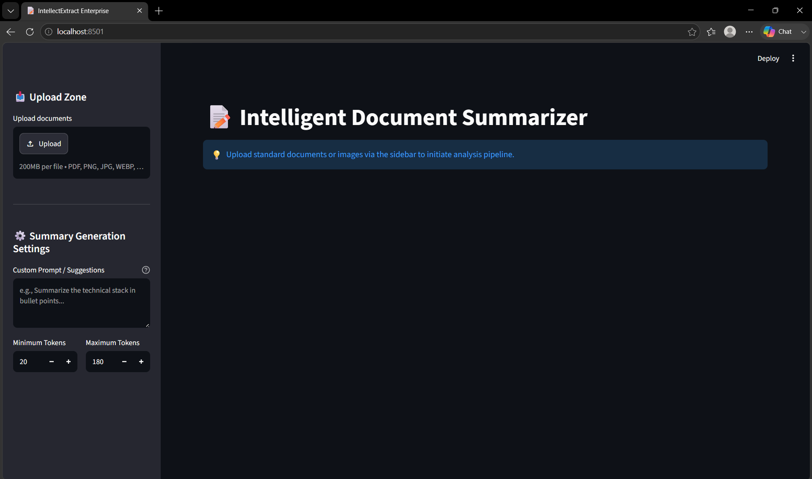
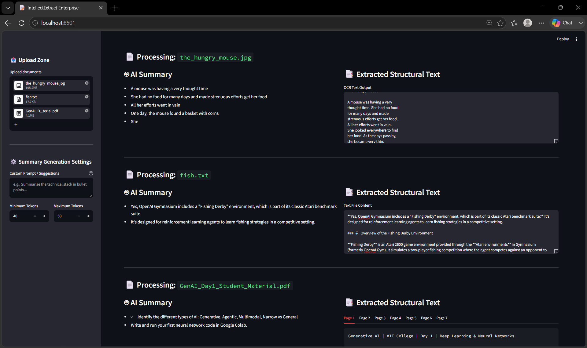

# 📝 IntellectExtract Enterprise

IntellectExtract Enterprise is an intelligent document processing pipeline built with **Streamlit** and powered by **Hugging Face's FLAN-T5 Large** model. It handles text extraction from multi-format files (PDFs, Images, and Text) and generates customizable abstractive summaries, allowing users to guide the AI with custom prompts and length limits.

---

## ✨ Features

- **Multi-Format Extraction:** Seamlessly handles text files, parsed PDFs, and optical character recognition (OCR) for uploaded images (`.png`, `.jpg`, `.jpeg`, `.webp`).
- **Dynamic Summarization:** Customize output results by adjusting minimal/maximal token sizes or injecting custom prompt instructions directly from the UI.
- **Robust Model Guardrails:** Implements repetition penalties and n-gram rules to ensure summaries remain informative and free from repetitive loops.
- **Side-by-Side Verification:** Compares the original raw text and the generated summary simultaneously across modular layouts and page-by-page tabs.

---

## 🛠️ Tech Stack

- **Frontend UI:** Streamlit
- **ML Engine:** Transformers (Hugging Face)
- **Base Model:** `google/flan-t5-large`
- **Core Processing:** PyTorch (CPU Optimized for Deployment)

---

## 🚀 Local Installation & Setup

Follow these steps to run the application locally on your machine:

### 1. Clone the Repository
```bash
git clone https://github.com
cd YOUR_REPO_NAME
```

### 2. Set Up a Virtual Environment
```bash
# Create environment
python -m venv venv

# Activate environment (Mac/Linux)
source venv/bin/activate

# Activate environment (Windows)
.\venv\Scripts\activate
```

### 3. Install Dependencies
```bash
pip install -r requirements.txt
```

### 4. Configure Your Credentials
Create a `.env` file in the root directory to store your Hugging Face access token:
```env
HF_TOKEN=hf_your_secret_token_here
```

### 5. Launch the Application
```bash
streamlit run app.py
```

---

## ☁️ Deployment Strategy

This application is configured for deployment on server-backed hosting platforms like **Streamlit Community Cloud** or **Hugging Face Spaces**.

### Secrets Configuration
When deploying online, ensure your Hugging Face access token is protected:
- **Streamlit Cloud:** Add `HF_TOKEN = "your_token"` inside the **Advanced Settings > Secrets** block.
- **Hugging Face Spaces:** Create a new **Repository Secret** named `HF_TOKEN` in the space settings panel.

> ⚠️ **Resource Note:** `flan-t5-large` requires ~3GB of RAM. If deploying to standard cloud free tiers that enforce strict limits (under 2-3GB total system memory), consider modifying `core/summarizer.py` and `app.py` to point to `google/flan-t5-base` to prevent Out-Of-Memory (OOM) crashes.

---

## 📂 Project Structure

```text
├── app.py                  # Main Streamlit web application interface
├── requirements.txt        # Application package dependencies
├── .env                    # Local environment variables (git-ignored)
├── core/
│   ├── __init__.py
│   ├── extractor.py        # Logic handling PDF, Image OCR, and TXT reading
│   └── summarizer.py       # FLAN-T5 wrapper with generation penalties
└── services/
    ├── __init__.py
    └── orchestrator.py      # Orchestrator routing text flows by file mime-type
```

---

## 🔍 Application Preview

<p align="center">
  
  
</p>

# 📝 IntellectExtract Enterprise

### 🚀 [Live Demo Application](https://document-summarization-system.streamlit.app/)

IntellectExtract Enterprise is an intelligent document processing pipeline built with **Streamlit** and powered by **Hugging Face's FLAN-T5 Large** model. It handles text extraction from multi-format files (PDFs, Images, and Text) and generates customizable abstractive summaries, allowing users to guide the AI with custom prompts and length limits.


